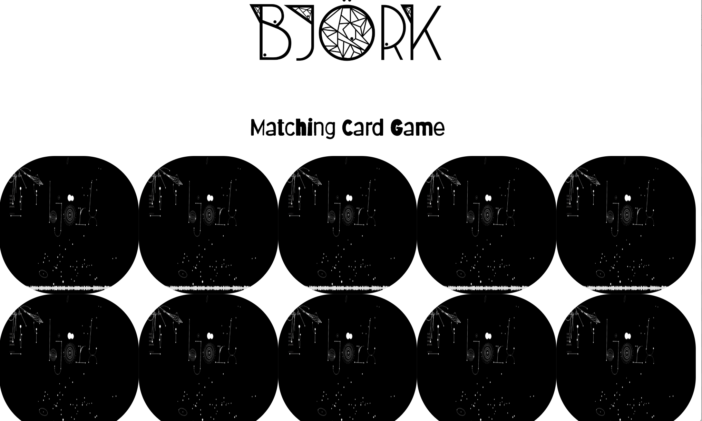

# Node Card Matching Game
This application allows users click on two card to check for a match. If there's no match, the cards flip back over. If there is a match, the cards stay face up. The objective of the game is to match all pairs of cards.

## How it's made:
**Tech Used** I used HTML, CSS and JavaScript and Node.js to build this application.

## Lesson Learned
Used setTimout() to delay my function from running so that the player could see whether their chosen cards matched or not.
