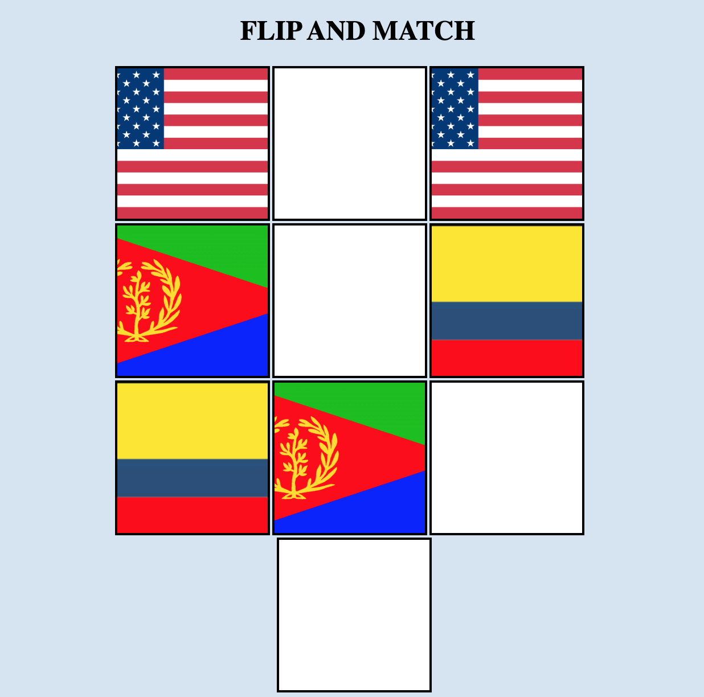

# ♠️ Project: Matching Card Game

### I made a 10 card memory game - users are  able to select two cards and check if they are a match. If they are a match, they stay flipped. If not, they flip back over. Game is done when all cards are matched and flipped over.  The game will then refresh, the cards are shuffled and the user can play again.

### Click here to play: https://upbeat-joliot-8a3e98.netlify.com/

Tech Used:
- HTML5
- CSS
- Javascript
