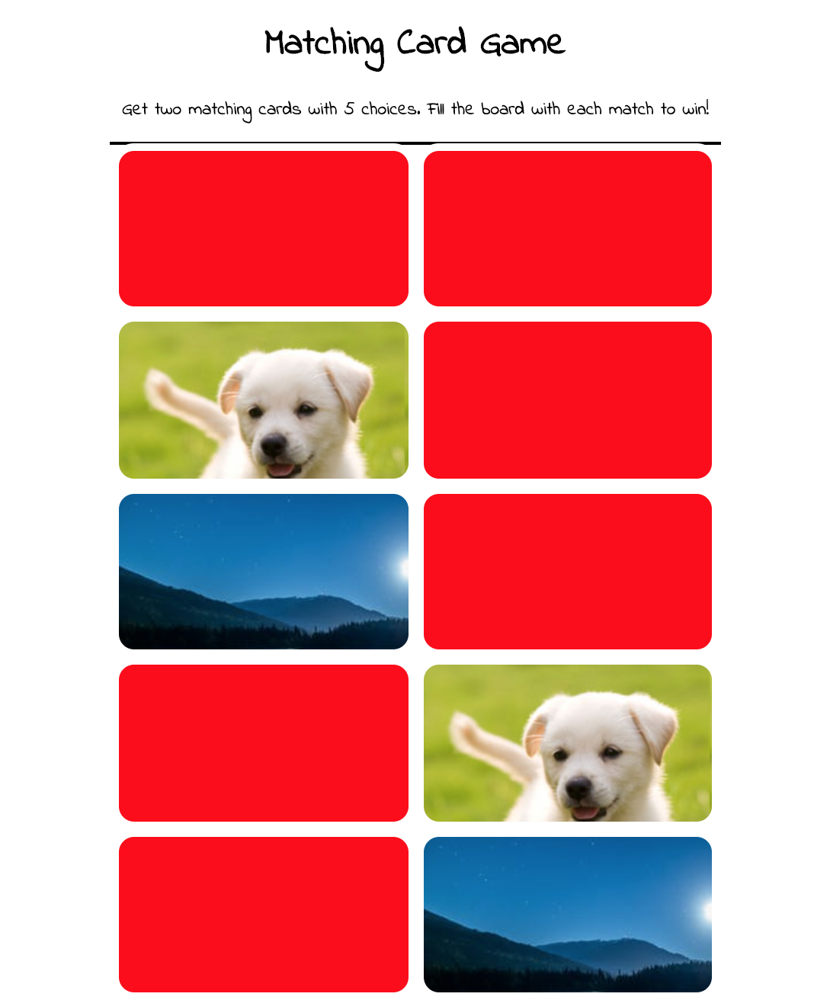

# My Awesome Project
This is a card game where the user can choose two matching cards until there are no more cards to match on the game sheet. Match all 5 pairs and win the game!

## How It's Made:

**Tech used:** HTML, CSS, JavaScript

This project was a great one to build. It gave me the ability to work on my hardpoints tenfold. I was able to use a randomizer algorithm to randomize when the page refreshed so that the user wouldn't be able to memorize the answer. timeout was used so that everytime a card was flipped the user wouldn't be able to see it after 1 second has passed. I was able to target the classlist as well as different elements within my array to make classes appear on the DOM without actually putting it into my HTML through JavaScript.

## Lessons Learned:
The lesson I learned while creating this project was that manipulation through JavaScript is all about initial planning. Pseudocode before writing any code so that you may visualize the game better and apply all steps necessary to complete application.

