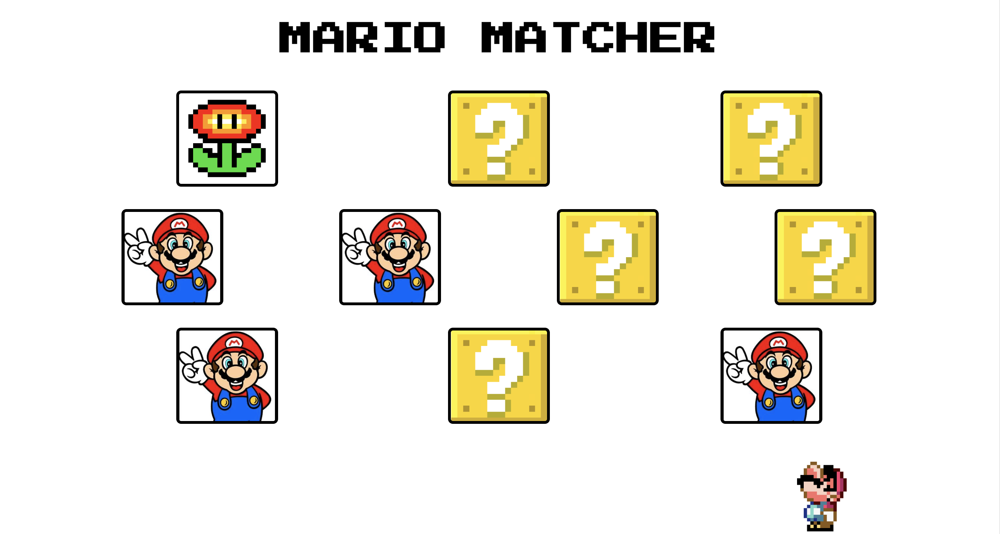

# Card Match Game
#### Project Scope: Create a card match game with 5 pairs. If a player selects a matching pair, the cards remain selected. If a a pair does not match, return the cards to their original state. When a player selects all matching pairs, they win! 
#### View here: https://svdev-cardmatch.netlify.com

# How it was made:
#### HTML5, CSS3, Javascript E6

# Optimizations:
#### When the player selects a matching pair, instead of keeping the cards selected, reveal another card that demonstrates the card is a successful match.    

# Lesson Learned: 
#### I really enjoyed this project! The includes method provided an unexpected work around in my code. I ran into an issue with my code in which the string containing a background image url couldn't be read by JS in a conditional statement. I discovered that the includes method allows you to target strings in variables by enclosing the parameters with characters that are unique to the string that you wish to target. 

