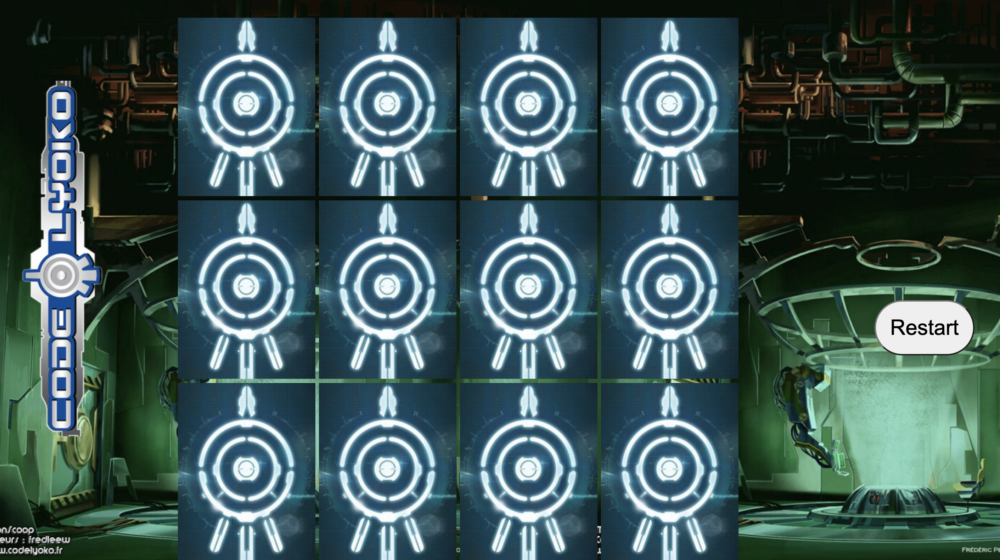

# ♠️ Week08 Bootcamp2019a Project: Matching Card Game


# Code Lyoko themed matching card game

This Javascript project applies this code lyoko to a matching card game. I used arrays, loops, and the setTimeout() method to create an appropriate pace.

To see deployed site, visit [The Application here](https://wonderful-easley-4bdc4b.netlify.app). See my other projects there as well!

## Screenshots



### Goal: Make a 10 card memory game - users must be able to select two cards and check if they are a match. If they are a match, they stay flipped. If not, they flip back over. Game is done when all cards are matched and flipped over. Example: http://www.fruit-burst.co.uk/fun-and-games/pairs-game

### How to submit your code for review:

- Fork and clone this repo
- Create a new branch called answer
- Checkout answer branch
- Push to your fork
- Issue a pull request
- Your pull request description should contain the following:
  - (1 to 5 no 3) I completed the challenge
  - (1 to 5 no 3) I feel good about my code
  - Anything specific on which you want feedback!

Example:
```
I completed the challenge: 5
I feel good about my code: 4
I'm not sure if my constructors are setup cleanly...
```
