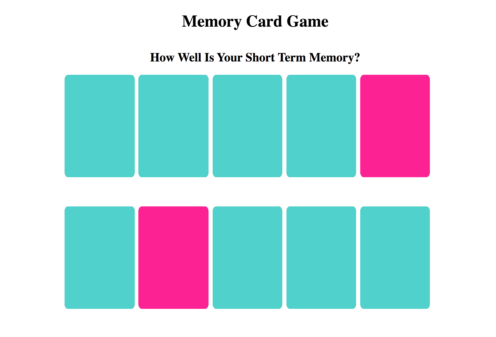

# ♠️ Week08 Bootcamp2019a Project: Matching Card Game

### Goal: Make a 10 card memory game - users must be able to select two cards and check if they are a match. If they are a match, they stay flipped. If not, they flip back over. Game is done when all cards are matched and flipped over.

* **Project Title: How well is your short term memory?**
  - "How well is your short term memory?" this webpage lets you play the famous memory card game. As described above the goal is to correctly match each card.

* **Overview**
  - Through javascript, HTML, and CSS I was able to re-create the memory card game.

* **link to project**: https://goofy-yalow-f1fa78.netlify.com

* **Image of project in use**

* **Getting Started**
  - Click on the link above
  - Click each card until you have a matching pair.
  - Once the entire board is matched click "Restart" , to play again
