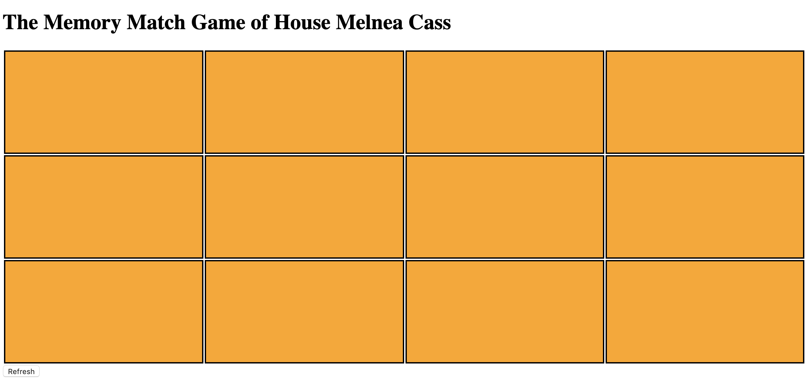

# Matching Card Day Project
I made a 10 card memory game - the users are able to select two cards and check if they are a match. When they are a match, they stay flipped. If not, they flip back over. The game is done when all cards are matched and flipped over.

Last week our group struggled a bit with this project. We worked w/ a mentor named Mark on Tuesday/Thursday, and he turned out to be a tremendous help. Our biggest hurdle was working through lines of code 14- 50. I rated our code a 3.5 because it's a little confusing for me to read through the lines of code I previously just mentioned. Nonetheless, visually, I think we did a great job with the framework. One of our team members suggested we give CSS Grid a try, and we turned out to be delighted with the results

## How It's Made:

**Tech used:** HTML, CSS, JavaScript
