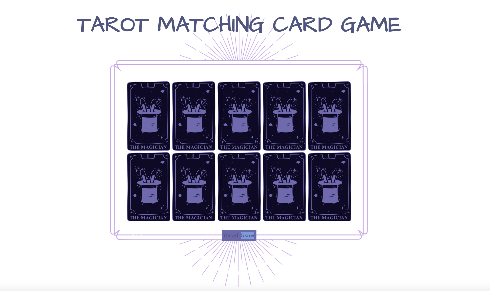
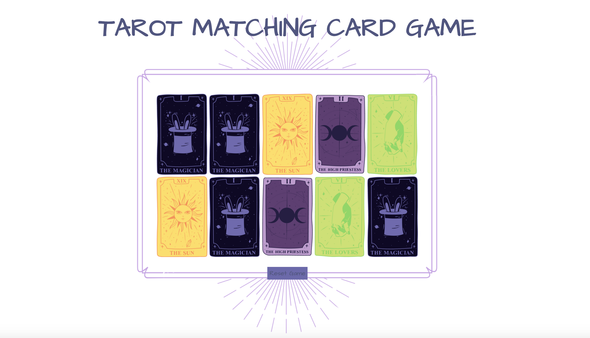

# ♠️ Week08 Bootcamp2019a Project: Matching Card Game

# Description: 

Created a 10 card memory game. Users are able to select two cards and check if they are a match. If they are a match, they stay flipped. If not, they flip back over. Game is done when all cards are matched and flipped over. 

# Tech Used:

 HTML, CSS, JS, API, JSON, NODE.JS

