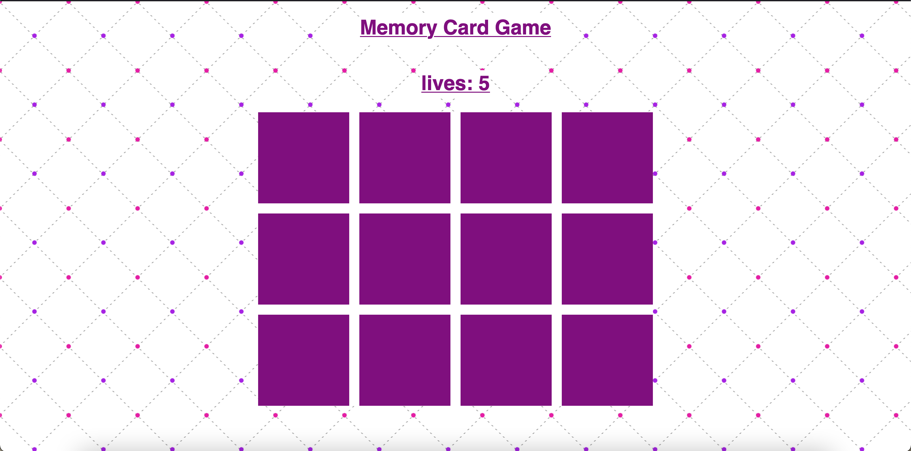

# Slot Machine
This is a project for creating a matching card game. There are twelve cards that have 6 matching images. Match the images to win the game. A twist on this game is that you have lives that deplete by one for each incorrect match. When your lives hit zero, the cards flip over and your lives restart. The cards are randomized after each restart.

**Link to project:** 

## How It's Made:

**Tech used:** HTML, CSS, JavaScript

I took a different approach to making this card game by using the javascript DOM model. The boxes are dynamically created in javascript. There are two additional boxes dynamically created in javascript that represent the front of card and back of card. CSS styling is used to have the cards rotate 180 degrees along the x axis, and transition with ease. 

The logic in this project is done by javascript. When two cards are selected a flipped class is added to a card using classList.add. an array is created representing flipped cards and stored in a variable. When the array size goes to 2, the game status is verified for a correct move by comparing the attribute names of the flipped cards, and they should match. If correct, the cards stay flipped. If not correct they flip back over.

## Optimizations

## Lessons Learned:

Some great takeaways from this project are using the javascript DOM to dynamically create the sections and card faces. This significantly reduced the code in the html to only a few lines of code.

The only downside is that we did break the separation of concerns by having our content in our Javascript instead of HTML. We also did not implement OOP so the game logic is exposed to the end user by inspecting the elements. I would not consider this project ready for implementation for these reasons.

Also, using pictures of my daughter made this project more enjoyable!

## Examples:

