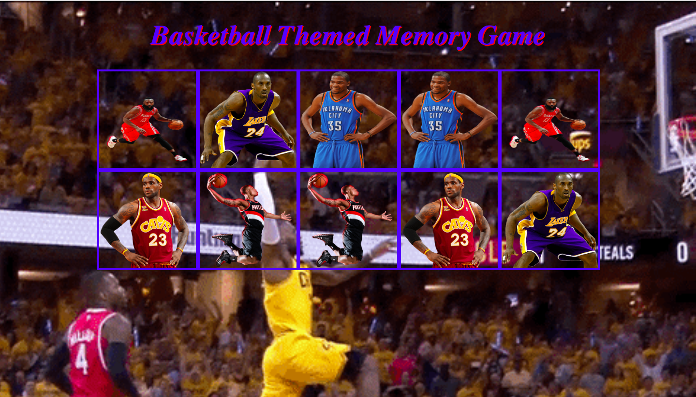

##This is an NBA inspired matching memory game that I built. The most important part of it to me is the use of the shuffle function to randomize the images which I had put in an array from the global scope.

I also kept track of the clicks for each box with the class classifcation, and with the help of the conditional statements I was able to configure those images in the boxes based on which one was clicked.

TOOLS used: HTML, CSS, JAVASCRIPT
