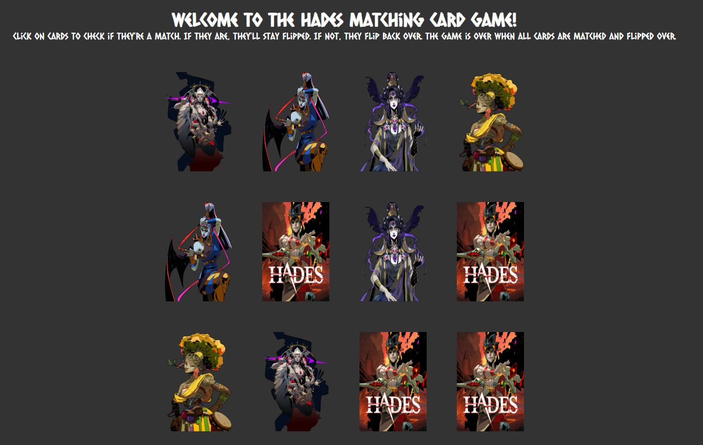

# Hades Matching Card Game
A 12 card memory game - users are able to select two cards and check if they are a match. If they are a match, they stay flipped. If not, they flip back over. Game is done when all cards are matched and flipped over.

# How It's Made
Tech used: HTML, CSS, JavaScript

# Lessons Learned:
 It's important to break your code down into small, manageable functions. By doing this, you can write more efficient and reusable code, which can save you time and effort in the long run. This project reminded me that it's crucial to test your code thoroughly throughout the creation process to ensure that it works as intended.

 This was the first time I used the CSS properties transform, transition, and perspective. These all played a part in creating the card flip functionality. Another first was the Immediately Invoked Function Expression used to shuffle the cards.

