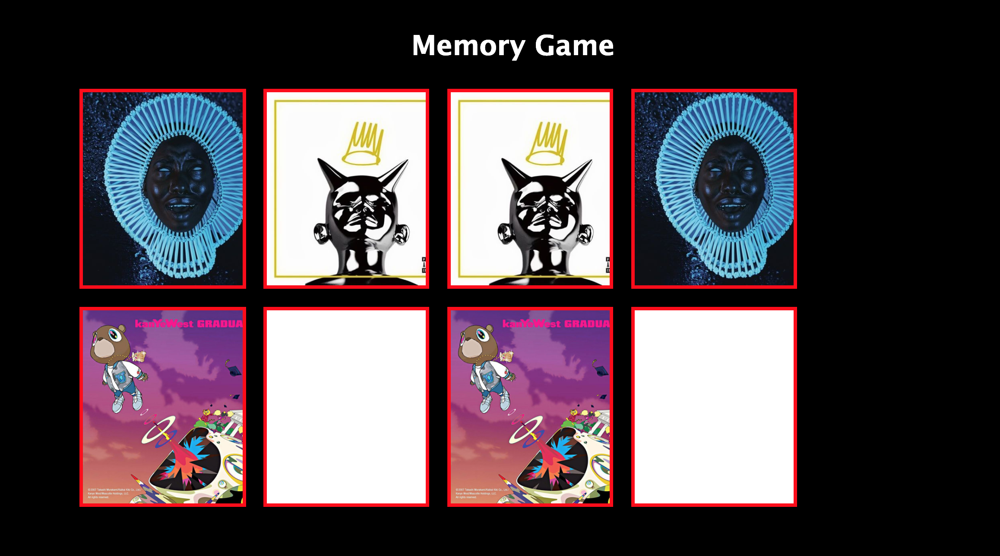

# My Memory Card Game Project
Goal: Make a 10 card memory game - users must be able to select two cards and check if they are a match. If they are a match, they stay flipped. If not, they flip back over. Game is done when all cards are matched and flipped over. Example: http://www.fruit-burst.co.uk/fun-and-games/pairs-game

## How It's Made:

**Tech used:** HTML, CSS, JavaScript, Framework of choice

## Lessons Learned:

This is the first time I used classList.add & classList.remove to add and remove classes within the html. 

