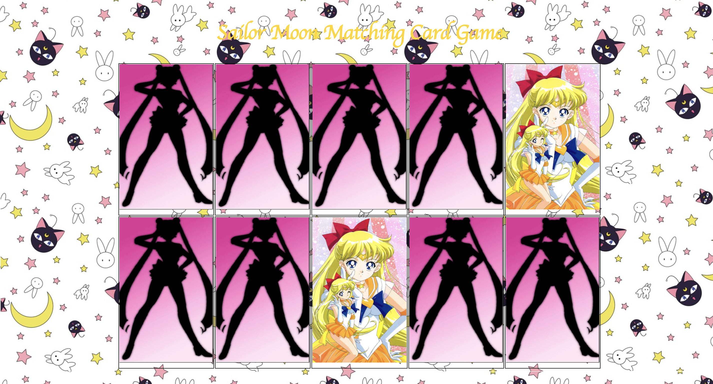

This is a Sailor Moon themed matching game application. The player must match the cards with the same image together. The game is over when all the cards are matched and flipped over.

Link to Project: [https://juliedodev-matchingcard.netlify.app/]

How It's Made:

Tech Used: HTML, CSS, JavaScript, Node.js

Optimizations: 

Lesson Learned: I learned how to randomize the shuffling of the cards and to do 'setTimeout'

