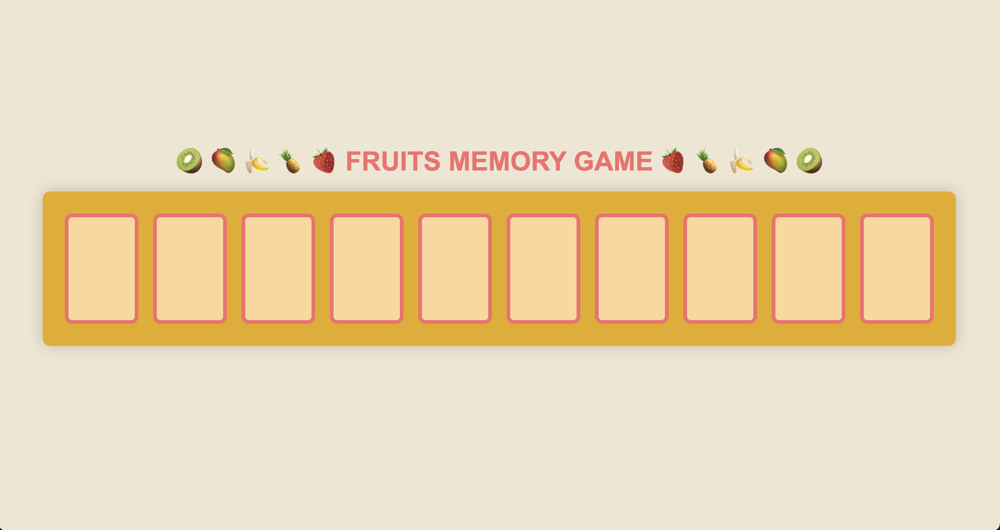

# ♠️ Week08 Bootcamp2019a Project: Matching Card Game

### Goal: Make a 10 card memory game - users must be able to select two cards and check if they are a match. If they are a match, they stay flipped. If not, they flip back over. Game is done when all cards are matched and flipped over.

# Fruit Memory Game
This simple app is a card matching game. The player selects 2 cards to test their memory, if it is correct the cards stay facing up and if not, the cards return to face down. The cards that are correct will stay face up until the user creates 5 fruity matches and wins the game!

**Link to project:** https://alejandralondev.github.io/matching-card-app/ 

## How It's Made:

**Tech used:** HTML, CSS, JavaScript,

## Lessons Learned:

Bugs, bugs, bugs. They are worth going back to fix after you've spent time away from the screen. 