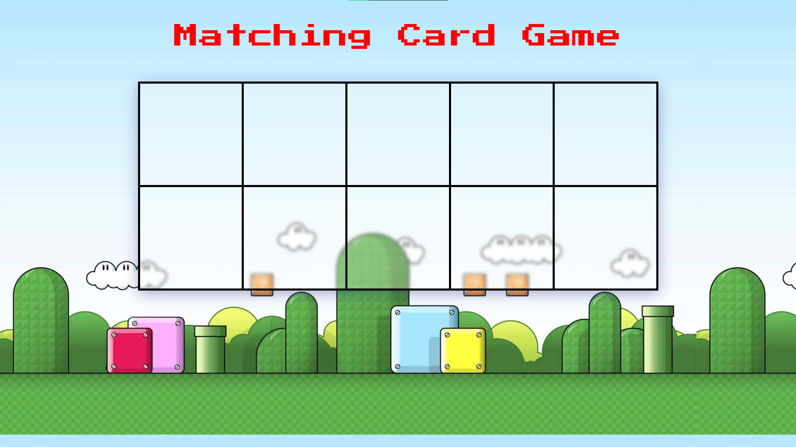

# Super Mario Memory Card Game 🍄🎮

## Project Description

### Goal
The goal of the Super Mario Memory Card Game is to create an entertaining 10-card matching game. Users can select two cards at a time, attempting to find matching pairs. The game is completed when all cards are successfully matched and flipped over.

### Main Purpose
This project aims to provide users with a fun and interactive Super Mario-themed memory card game experience.

### Example
For reference, you can check out a similar game [here](http://www.fruit-burst.co.uk/fun-and-games/pairs-game).

## How It's Made 🛠️

- **Technologies Used:** HTML, CSS, JavaScript (OOP)
- **Project Organization:**
  - Organized project into folders: css (for styles), js (for JavaScript files), img (for image files), and the root folder containing README and index.html.

## Lessons Learned 🧠

During the development of the Super Mario Memory Card Game, several key lessons were learned:

### Object-Oriented Programming (OOP)
The project significantly enhanced understanding of OOP principles. Concepts such as encapsulation, abstraction, inheritance, and polymorphism were applied to create a well-organized and efficient code structure.

### Accessing Object Properties and Methods
Working with the Super Mario Memory Card Game involved extensive interaction with object properties and methods. Learning how to access and manipulate these components contributed to a deeper understanding of JavaScript objects.

### Importance of the `this` Keyword in OOP
The `this` keyword played a crucial role in OOP implementation. It was used to refer to the current instance of an object, allowing for the proper interaction and manipulation of object properties and methods.

## Getting Started 🚀

To play the matching card game, follow these steps:

1. Clone the repository.
2. Open the `index.html` file in your preferred web browser.
3. Click any box to start playing

Feel free to contribute, report issues, or provide feedback to enhance Super Mario Matching Card Game.