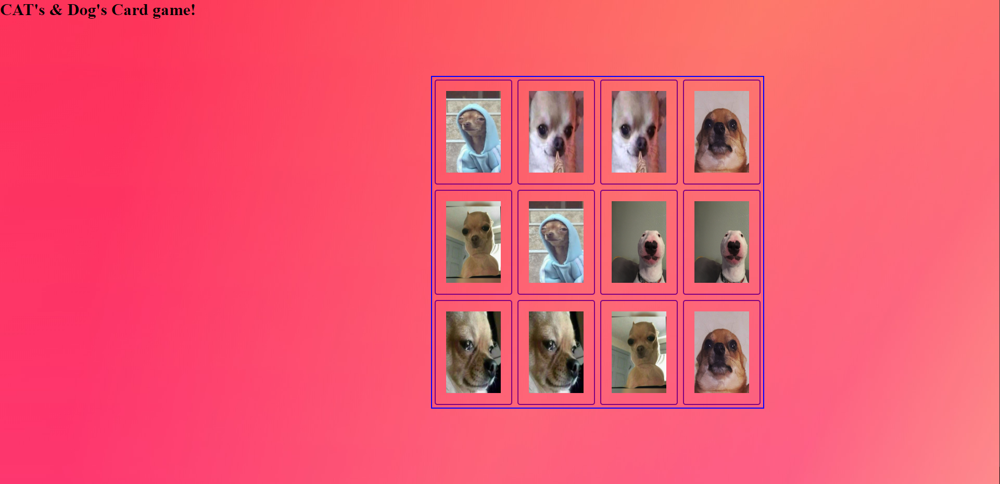

 🎤Project: Matching card game!

This is my Matching card game project, a cool web application built with HTML, CSS, and JavaScript. It's about matching cards 12 cards in total, i went with a dog & cat theme. Good luck

 

## How It's Made

I used HTML, CSS, and JavaScript to create this project, I used HTML to layout the cards & CSS to style, Javascript to create the logic of the cards being flipped & unflipped & reset once they were not a match.

## Lessons Learned
I learned alot with this project such as exsactly how many steps needed to run a game like this, i was missing some of the logic in the beginning trying to recreate this project with pieces with a previous project called Tic tac toe. There were alot of changes such as making a memory system that remembers the cards unflipped & setting a time out to not break the games logic are some of the examples i found interesting.

## Examples

If you want to see more of my work, feel free to explore my portfolio! [GitHub](https://github.com/Michaelariasdls).
