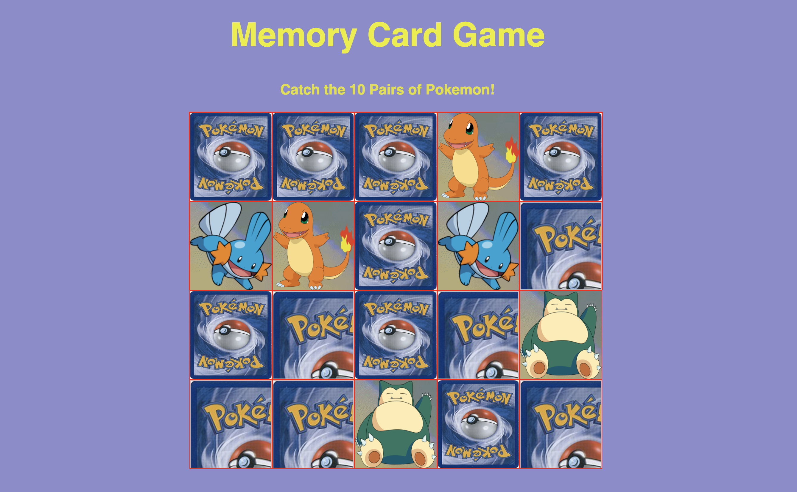

# Matching Card Game

### Goal: Make a 10 card memory game - users must be able to select two cards and check if they are a match. If they are a match, they stay flipped. If not, they flip back over. Game is done when all cards are matched and flipped over.

### Click here to play: https://cranky-wiles-4ed375.netlify.com/

Tech Used:
- HTML 5
- CSS
- Javascript
