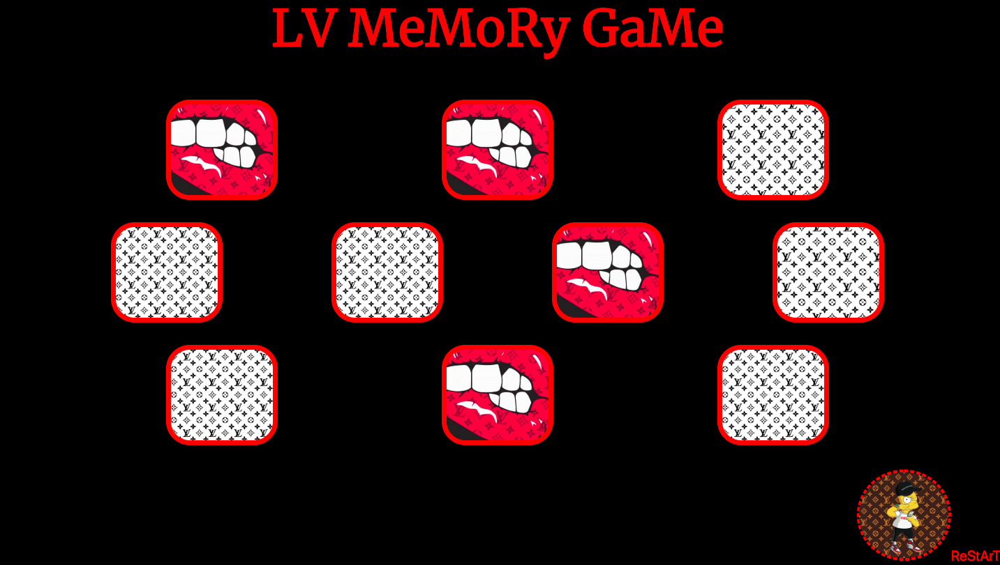

# ♠️  Matching Card Game

### Goal: Make a 10 card memory game - users must be able to select two cards and check if they are a match. If they are a match, they stay flipped. If not, they flip back over. Game is done when all cards are matched and flipped over.

## Tech used:CSS, Javascript,html

#Optimizations

###When a card is clicked on it displays a color. Click on a another card to match the color. If color is matched then card will stay displayed with an image.
