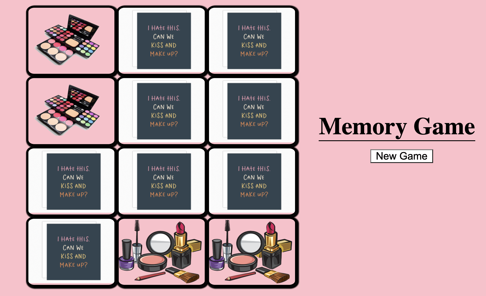

# ♠️ Project: Matching Card Game

### Goal: Make a 10 card memory game - users must be able to select two cards and check if they are a match. If they are a match, they stay flipped. If not, they flip back over. Game is done when all cards are matched and flipped over.

**View project in browser:** https://endev-matchingcardgame.netlify.com

## Design and Development:
**Tech Used** HTML, CSS, JavaScript

## Reflections:
It was a challenge trying to figure out the code to switch classes between cards but I was able to get there with some trial and error. It was fun to build a game where elements of code can be applied to so many other projects!
